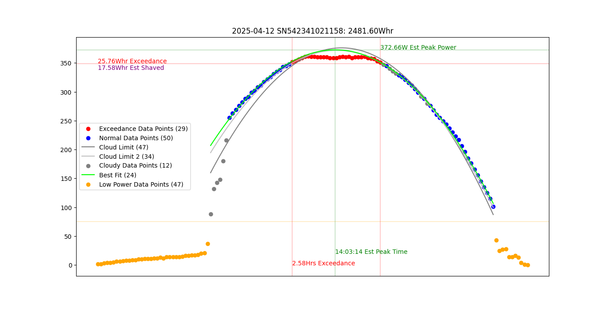

# Enphase-Inverter-Analyzer
This utility stores individual inverter output in a database and analyzes it to look for power shaving losses.

# inverter_capture.py
The inverter_capture.py utility must run continuously while the inverters are producing power to track their output.
I run mine on a QNAP NAS with a MariaDB, but the setup was complicated and annoying.  It is also possible to 
run using SQLite which has no security and setup is completely automatic.  You just need to make sure the computer
you are running on does not go to sleep during the day, or you will lose data.  Also, the SQLite database operates
in WAL mode, so all access must be from the same computer.  This is needed because the analysis tool has a long
running QUERY and in rollback journal mode this causes writer starvation, blocking the capture utility.

To connect to your Enphase Gateway, you will need to setup credentials.json in the local directory.
```json
{
    "gateway_host": "https://envoy.local or static IP",
    "gateway_serial_number": "<get from https://envoy.local>",
    "gateway_token": "<get_from_https://entrez.enphaseenergy.com/login>",

    "database_host": "",
    "database_port": 3306,
    "database_username": "",
    "database_password": "",
    "database_database": ""
}
```
NOTE: the entrez web-site can be finicky.  After logging in it will ask you to "Select System".  This is your system
name which can be found above Site ID in the upper left of the ENPHASE app.  My system name is my first and last name.
When you get the "Select System" field correct, the "Select Gateway" field should auto-populate with your gateway's
serial number.  Press "Create access token", and your access token will appear on the next page.  Copy it into 
credentials.json.  You can also use it to access your gateway's built-in web-page.  You will have to skip past your
browser's security warnings and the gateway's "Sorry you are not authorized to view that page" message, but then
you can paste in the token and access the meager web-site. It is useful for setting up a Static IP address though.
I think the token only lasts for a year, but mine is still going strong so I'm not sure.


You can enter MySQL database parameters in your credentials file instead of using command line if you prefer...
The EnphaseAPI code will create a gateway.cer file in the local directory.  Don't delete it. ;-)

You will need to install the enphase_api:
python -m pip install Enphase_API
If using mysql, you may need to install the mysql connector:
python -m pip install mysql-connector-python

Command line arguments control database connection and poll frequency (use -help).  My inverters send new data
every 331 seconds, so the default poll interval is 60 seconds.  Progress is logged to stdout every 5 minutes
and errors are sent to stderr.  The program is designed to run continuously so it captures all signals and
attempts to restart itself if something goes wrong with the gateway or the database.

# inverter_analyzer.py
Once the capture utility has been running for a complete day (sun-up to sun-down), you can run inverter_analyzer.py
This program analyzes the inverter output and produces a report with a line for each inverter every day.
It does this by attempting to map a parabola to the non-exceedance inverter output (i.e. output less than max continuous).
To be successful, data for an inverter/day is eliminated if it does not meet the following criteria: 
MAX_START_POWER < 20 and MIN_END_POWER = 0 and at least 50 data points (make sure the daily data is complete).
All data below 75W is ignored as the trail-in and trail-out data is not very parabolic.
All data above the MAX_CONTINUOUS parameter is also ignored as the true data could be higher.
Then the system fits a parabola to the data and looks for cloud drop-outs (a drop of 5W or more).
The cloud points are ignored and a new cloud parabola is fitted to the remaining data.  New cloud points are 
generated and a final parabola is fitted to the data.

Once this is complete, the EXCEEDANCE energy is calculated.  EXCEEDANCE energy is the power generated beyond
MAX_CONTINUOUS * time.  My system has IQ8A inverters with a MAX_CONTINUOUS rating of 349W, but their PEAK rating is 366.  
I also calculate the estimated peak power output from the parabola, and the SHAVED energy, which is the difference between 
the estimated power and the exceedance power * time.  This gives you an idea of how much energy is lost by the undersized
inverters.

In addition to the report, you can also view the plotted output by selecting the -PlotType parameter.  Here is an example:

As you can see, this particular panel is shaded in the early morning, but it comes on strong with a estimated peak power of
373W (its a 430W STC/327W NMOT panel and I'm in the SFBay area).  I lost <1% due to shaving on this inverter on this day.  
After two passes of cloud removal (the silver and gray lines) the green fit line does an excellent job of tracking the output.

NOTE: depending on your PlotType and PlotLimit criteria, you may get many plots.  After viewing (or saving) a plot, just press 
**q** or close the window and the next plot will appear.  If you have too many plots go to the output window and press CTRL-C
and it will stop (though you may have to move your cursor to the current plot first).

The program can produce a line for each day-inverter by setting the Detail flag to True.  It also produces a summary:
```
Processed 102 days of data for 44.0 inverters with a total output of 9,454,863.38Whr.
Average generated power per day: 92694.74Whr (2,106.70Whr per inverter)
Maximum inverter power: 2,994.13Whr (by SN542341021944 on 2025-05-22)
Total exceedance power: 12,203.96Whr
Maximum exceedance power: 35.26Whr (by SN542341021917 on 2025-05-22)
Total shaved power: 1,217.51Whr
Maximum shaved power: 17.58Whr (by SN542341021158 on 2025-04-12)
Shave ratio: 0.01% (total shaved power / total generated power)
```


This program would not be possible without Matthew1471's Enphase-API (https://github.com/Matthew1471/Enphase-API).  Thanks alot Matthew - stellar work!
